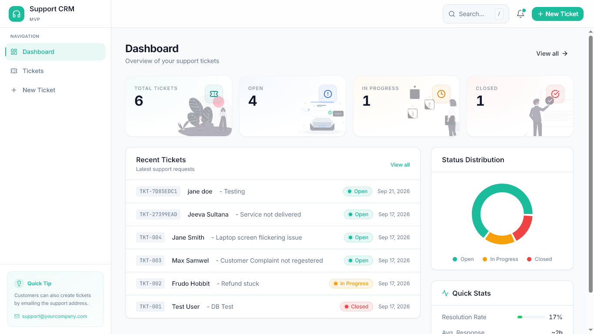
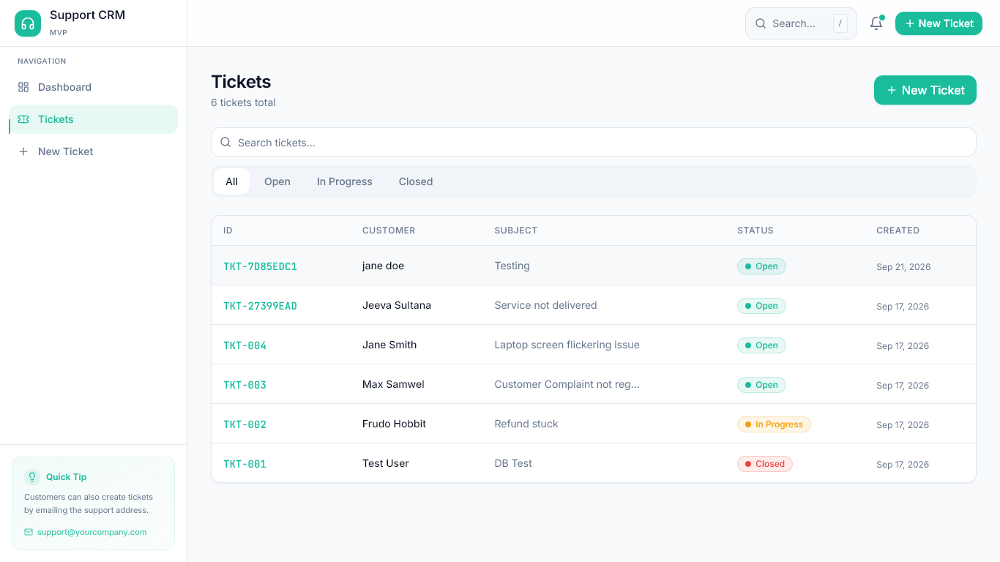
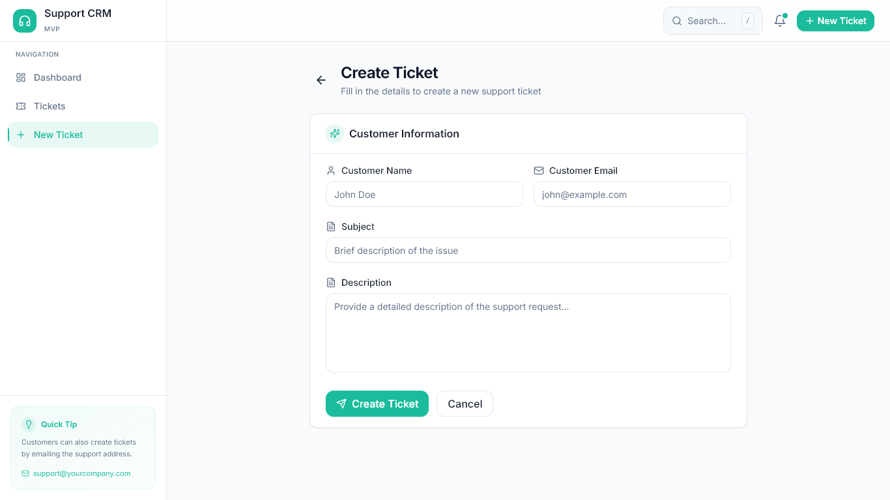

<div align="center">

# Support CRM

### Customer support ticketing system with email ingestion

A full-stack application for managing support tickets -- create manually or automatically from incoming emails, track status, add internal notes, and monitor performance through a real-time dashboard.

[](https://reactjs.org/)
[](https://www.typescriptlang.org/)
[](https://fastapi.tiangolo.com/)
[](https://www.postgresql.org/)
[](https://tailwindcss.com/)
[](https://vitejs.dev/)

</div>

---

## Screenshots

<p align="center">
  
</p>

<p align="center">
  
  &nbsp;&nbsp;
  
</p>

---

## Overview

Support CRM is a lightweight, production-ready ticketing system built for support teams. It combines a modern React frontend with a FastAPI backend and PostgreSQL database, plus a standalone email worker that polls IMAP inboxes to automatically create tickets from structured support emails.

### Core Capabilities

| Feature | Description |
|---------|-------------|
| Ticket Lifecycle | Create, update, and track tickets through Open, In Progress, and Closed states |
| Email Ingestion | Automatically parse incoming support emails and create tickets via IMAP polling |
| Full-Text Search | Search across ticket ID, customer name, email, subject, and description |
| Internal Notes | Add threaded comments to tickets for team collaboration |
| Dashboard Analytics | KPI cards, pie chart breakdown by status, and recent ticket activity |
| Responsive Design | Works seamlessly across desktop and mobile devices |

## Tech Stack

| Layer | Technology | Purpose |
|-------|-----------|---------|
| Frontend | React 18, TypeScript, Vite | SPA with type-safe components and fast builds |
| Styling | Tailwind CSS, shadcn-style design tokens | Utility-first CSS with a custom design system |
| Charts | Recharts | Dashboard visualizations |
| Animations | Framer Motion | Spring-based transitions and staggered reveals |
| Backend | FastAPI, Pydantic | High-performance async API with schema validation |
| Database | PostgreSQL (Supabase) | Relational data with connection pooling |
| Email Worker | Python, imaplib, httpx | Standalone IMAP poller with HTTP API integration |

## Architecture

```
+-----------------------------------------------------------+
|                    React Frontend                          |
|   Dashboard  |  Ticket List  |  Detail  |  Create Form    |
+-----------------------------+-----------------------------+
                              | HTTP/JSON
+-----------------------------v-----------------------------+
|                    FastAPI Backend                          |
|   Routes -> Services -> Pydantic Schemas -> psycopg2      |
+-----------------------------+-----------------------------+
                              | SQL
+-----------------------------v-----------------------------+
|                  PostgreSQL (Supabase)                      |
|              tickets table  <-  notes table                 |
+-----------------------------------------------------------+

+-----------------------------------------------------------+
|                   Email Worker                              |
|   IMAP Mailbox -> Regex Parser -> POST /api/tickets        |
+-----------------------------------------------------------+
```

## Project Structure

```
mini-crm/
|-- apps/
|   |-- web/                        # React frontend (Vite + TypeScript)
|   |   |-- src/
|   |       |-- pages/              # Dashboard, TicketList, TicketDetail, CreateTicket
|   |       |-- components/         # Button, Card, Input, Badge, Toast, Skeleton
|   |       |-- lib/                # API client, utilities
|   |       |-- types/              # TypeScript interfaces
|   |       |-- assets/pics/        # Application screenshots
|   |       +-- assets/illustrations/  # Custom SVG illustrations
|   +-- api/                        # FastAPI backend
|       +-- app/
|           |-- main.py             # App entry, CORS, exception handler
|           |-- database.py         # PostgreSQL connection (pooler + fallback)
|           |-- schemas.py          # Pydantic request/response models
|           |-- routes/             # HTTP endpoint definitions
|           +-- services/           # Business logic and SQL queries
|-- email_worker/                   # Standalone email polling service
|   |-- main.py                     # Worker loop (60s interval)
|   |-- mailbox.py                  # IMAP connection and email fetch
|   |-- parser.py                   # Structured email body parser
|   +-- client.py                   # HTTP client for API calls
|-- docs/                           # Architecture, security, and data docs
+-- .env.example                    # Environment variables template
```

---

## Getting Started

### Prerequisites

- Python 3.11+
- Node.js 18+
- A Supabase PostgreSQL database

### 1. Database Setup

Run the schema from `docs/schema.sql` against your PostgreSQL database. This creates:

- `tickets` table with status constraint (`Open`, `In Progress`, `Closed`)
- `notes` table with cascade delete on ticket removal
- Indexes on `status`, `ticket_id`, and `notes.ticket_id`

### 2. Backend

```bash
cd apps/api
python -m venv .venv
source .venv/bin/activate   # Windows: .venv\Scripts\activate
pip install -r requirements.txt
uvicorn app.main:app --reload
```

API runs at `http://localhost:8000`

### 3. Frontend

```bash
cd apps/web
npm install
npm run dev
```

Frontend runs at `http://localhost:5173` with API proxy configured to the backend.

### 4. Email Worker (Optional)

```bash
cd email_worker
python -m venv .venv
source .venv/bin/activate
pip install -r requirements.txt
python main.py
```

Polls the configured IMAP mailbox every 60 seconds.

---

## API Reference

### Health Check

```
GET /api/health

-> 200 { "status": "healthy" }
```

### Create Ticket

```
POST /api/tickets
Content-Type: application/json

{
  "customer_name": "John Doe",
  "customer_email": "john@example.com",
  "subject": "Login issue",
  "description": "Cannot access my account after password reset"
}

-> 201 { "ticket_id": "TKT-A1B2C3D4", "created_at": "..." }
```

### List Tickets

```
GET /api/tickets
GET /api/tickets?status=Open
GET /api/tickets?search=john

-> 200 [
    {
      "ticket_id": "TKT-A1B2C3D4",
      "customer_name": "John Doe",
      "subject": "Login issue",
      "status": "Open",
      "created_at": "..."
    }
  ]
```

### Get Ticket Detail

```
GET /api/tickets/{ticket_id}

-> 200 {
    "ticket_id": "TKT-A1B2C3D4",
    "customer_name": "John Doe",
    "customer_email": "john@example.com",
    "subject": "Login issue",
    "description": "Cannot access my account...",
    "status": "Open",
    "notes": [
      { "id": 1, "note_text": "Looking into this...", "created_at": "..." }
    ]
  }
```

### Update Ticket

```
PUT /api/tickets/{ticket_id}
Content-Type: application/json

{
  "status": "In Progress",
  "note_text": "Investigating the issue"
}

-> 200 { "success": true, "updated_at": "..." }
```

---

## Email Ingestion

The email worker parses structured support emails with this format:

```
Name: John Doe
Email: john@example.com
Description: I need help with my account billing
```

The parser uses regex pattern matching (no AI dependency) and creates tickets through the same `POST /api/tickets` endpoint as manual creation. Processed emails are marked with the IMAP `\Seen` flag to prevent duplicates.

## Database Schema

```sql
CREATE TABLE tickets (
    id             BIGSERIAL PRIMARY KEY,
    ticket_id      VARCHAR(20) NOT NULL UNIQUE,    -- TKT-{8-char-hex}
    customer_name  VARCHAR(150) NOT NULL,
    customer_email VARCHAR(320) NOT NULL,
    subject        VARCHAR(250) NOT NULL,
    description    TEXT NOT NULL,
    status         VARCHAR(20) NOT NULL DEFAULT 'Open',
    created_at     TIMESTAMPTZ NOT NULL DEFAULT NOW(),
    updated_at     TIMESTAMPTZ NOT NULL DEFAULT NOW(),
    CONSTRAINT tickets_status_check
        CHECK (status IN ('Open', 'In Progress', 'Closed'))
);

CREATE TABLE notes (
    id         BIGSERIAL PRIMARY KEY,
    ticket_id  VARCHAR(20) NOT NULL REFERENCES tickets(ticket_id) ON DELETE CASCADE,
    note_text  TEXT NOT NULL,
    created_at TIMESTAMPTZ NOT NULL DEFAULT NOW()
);
```

**Key design decisions:**

- **UUID-based ticket IDs** (`TKT-{hex}`) eliminate race conditions from sequential numbering
- **Cascade delete** ensures notes are removed when their parent ticket is deleted
- **Database-level CHECK constraint** enforces valid status values at the storage layer
- **Timezone-aware timestamps** (`TIMESTAMPTZ`) for consistent time handling across regions

---

## Security

- **Parameterized queries** -- All SQL uses `%s` placeholders; no string interpolation in queries
- **Input validation** -- Pydantic schemas enforce max lengths (name: 255, subject: 500, description: 10,000, notes: 5,000)
- **Email validation** -- Pydantic `EmailStr` validates customer email format
- **CORS restriction** -- Configured to allow only the frontend origin
- **Error handling** -- Global exception handler suppresses stack traces in production
- **Environment-based config** -- All credentials and secrets loaded from environment variables

## Deployment

| Service | Platform | Notes |
|---------|----------|-------|
| Frontend | Vercel | SPA with rewrite rules for client-side routing |
| Backend | Render | Uvicorn ASGI server |
| Database | Supabase | Managed PostgreSQL with connection pooling |
| Email Worker | Self-hosted | Standalone Python process |

## Design System

The frontend uses a custom design system built on Tailwind CSS with CSS custom properties (HSL tokens):

- **Primary:** Teal `#21B6A8` -- used for interactive elements and accents
- **Typography:** Inter (body) + JetBrains Mono (code and ticket IDs)
- **Components:** Button (4 variants), Card, Input, Select, Badge, StatusBadge, Toast, Skeleton, EmptyState
- **Motion:** Framer Motion spring physics with custom easing curves
- **Illustrations:** 8 custom SVG illustrations for empty states and KPI cards

---

<div align="center">

Built with React, FastAPI, and PostgreSQL

</div>
